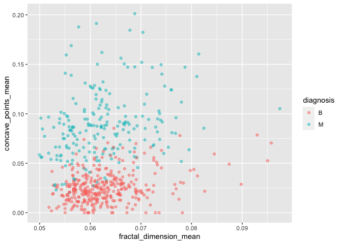
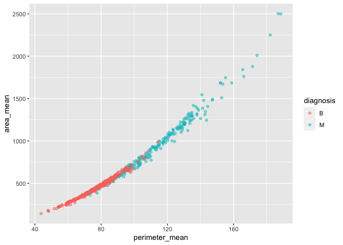
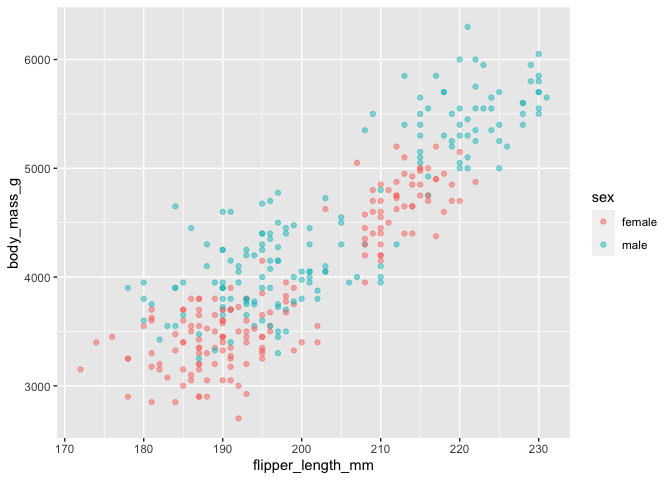
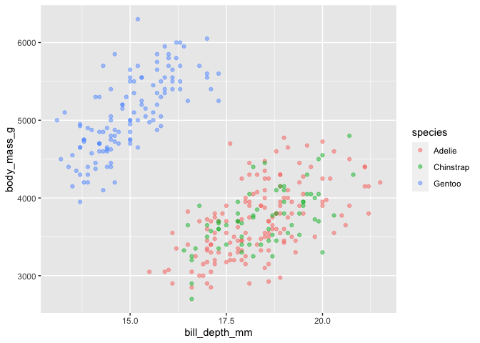

STAT545_AssignmentB1
================
Chang Liu
2023-11-01

``` r
library(datateachr) # <- might contain the data you picked!
library(tidyverse)
library(palmerpenguins)
library(testthat)
```

## Exercise 1: Make a Function

In the MDA project, I used the following function for three times to
analyze the relation between two parameters within two groups. And the
only difference is that I used different columns for x and y axis.
Therefore, it would be appropriate to make this a function.

``` r
plot_numeric_relation <- function(dataset,x_axis,y_axis,z_group){
  if (!(x_axis %in% names(dataset) && y_axis %in% names(dataset) && z_group %in% names(dataset))) {
    stop("One or more columns are not present in the dataset")
  }
  
  if (!is.numeric(dataset[[x_axis]]) || !is.numeric(dataset[[y_axis]]) || is.numeric(dataset[[z_group]])) {
    stop("x and y columns must be numeric while z column must be non-numeric")
  }
  dataset <- na.omit(dataset[c(x_axis, y_axis, z_group)])
  ggplot(dataset, aes_string(x = x_axis, y = y_axis, color = z_group)) +
    geom_point(alpha = 0.5)+
    labs(x=x_axis,y=y_axis)
}
```

## Exercise 2: Document your Function

``` r
#' Plot Numeric Relation
#'
#' This function creates a scatter plot to visualize the relationship between two numeric variables x and y, grouped by z_group.
#'
#' @param dataset The input dataset containing the variables to be plotted.
#' @param x_axis The name of the column representing the x-axis variable.
#' @param y_axis The name of the column representing the y-axis variable.
#' @param z_group The name of the column for grouping the data points by color.
#'
#' @return A scatter plot showing the relationship between the specified variables.
#'
#' @examples
#' plot_numeric_relation(cancer_sample, "fractal_dimension_mean", "concave_points_mean", "diagnosis")
plot_numeric_relation <- function(dataset, x_axis, y_axis, z_group) {
  if (!(x_axis %in% names(dataset) && y_axis %in% names(dataset) && z_group %in% names(dataset))) {
    stop("One or more columns are not present in the dataset")
  }
  
  if (!is.numeric(dataset[[x_axis]]) || !is.numeric(dataset[[y_axis]]) || is.numeric(dataset[[z_group]])) {
    stop("x and y columns must be numeric while z column must be non-numeric")
  }
  dataset <- na.omit(dataset[c(x_axis, y_axis, z_group)])
  ggplot(dataset, aes_string(x = x_axis, y = y_axis, color = z_group)) +
    geom_point(alpha = 0.5) +
    labs(x = x_axis, y = y_axis)
}
```

## Exercise 3: Include examples

Exploring the relation between fractal_dimension_mean and
concave_points_mean within benign and magligant groups.

``` r
plot_numeric_relation(cancer_sample,"fractal_dimension_mean","concave_points_mean","diagnosis")
```

    ## Warning: `aes_string()` was deprecated in ggplot2 3.0.0.
    ## ℹ Please use tidy evaluation idioms with `aes()`.
    ## ℹ See also `vignette("ggplot2-in-packages")` for more information.
    ## This warning is displayed once every 8 hours.
    ## Call `lifecycle::last_lifecycle_warnings()` to see where this warning was
    ## generated.

<!-- -->

Exploring the relation between perimeter_mean and area_mean within
benign and magligant groups.

``` r
plot_numeric_relation(cancer_sample,"perimeter_mean","area_mean","diagnosis")
```

<!-- -->

Exploring the relation between flipper_length_mm and body_mass_g in male
and female groups.

``` r
plot_numeric_relation(penguins,"flipper_length_mm","body_mass_g","sex")
```

<!-- -->

Exploring the relation between bill_depth_mm and body_mass_g within
different species.

``` r
plot_numeric_relation(penguins,"bill_depth_mm","body_mass_g","species")
```

<!-- -->

There would be error in this example since ‘dd’ does not exist.

``` r
plot_numeric_relation(penguins,"bill_depth_mm","species","dd")
```

    ## Error in plot_numeric_relation(penguins, "bill_depth_mm", "species", "dd"): One or more columns are not present in the dataset

There would be error in this example since body_mass_g is a numeric
value, which should not be used to classify groups.

``` r
plot_numeric_relation(penguins,"bill_depth_mm","species","body_mass_g")
```

    ## Error in plot_numeric_relation(penguins, "bill_depth_mm", "species", "body_mass_g"): x and y columns must be numeric while z column must be non-numeric

## Exercise 4: Test the Function

``` r
test_that("Testing plot_numeric_relation function", {
  # Column with no NAs
  penguins_no_NA <- penguins[complete.cases(penguins), ]  # Select rows without NAs
  expect_silent({
    plot_numeric_relation(penguins_no_NA, "bill_depth_mm", "body_mass_g", "species")
  })
  
 # Column that has NAs
  expect_silent({
    plot_numeric_relation(penguins, "bill_depth_mm", "body_mass_g", "species")
  })

  # Column of a different type
  expect_error({
    plot_numeric_relation(penguins, "bill_depth_mm", "species", "body_mass_g")
  })

  # Column of length 0
  empty_dataset <- data.frame()
  expect_error({
    plot_numeric_relation(penguins, "bill_depth_mm", "body_mass_g", "empty")
  })
 
})
```

    ## Test passed 🎊
